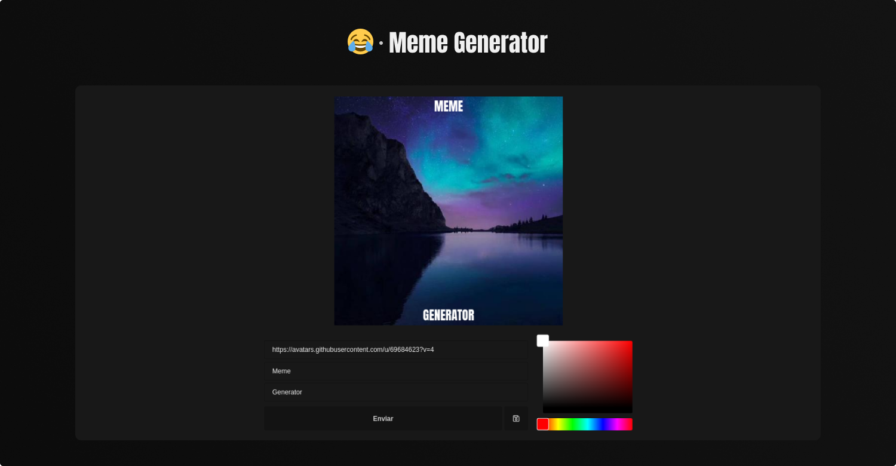

<h1 align="center">😂 Meme Generator</h1>



> Um gerador de memes personalizados feito com React e Canvas.

## 📃 Conteúdo

  1. [Como funciona?](#-como-funciona?)
  2. [Tecnologias](#-tecnologias)
  3. [Teste o projeto](#-teste-o-projeto)
  3. [Instalação](#-quer-instalar)

## 🤔 Como funciona?

  1. A url, o texto de cima e o de baixo, que são digitados nos inputs, além da cor selecionada na roda de cores, são salvos em um State do React, que será acessado novamente por meio do context.
  2. A imagem da url é carregada via Canvas e guardada junto com a url, texto e cor.
  3. O meme aparece no dispositivo do usuário com ajuda de um Effect do React, que é disparado sempre que o objeto "meme" é alterado.

## 📡 Tecnologias

  - [React](https://reactjs.org/)
  - [Vite](https://vitejs.dev/)
  - [TypeScript](https://www.typescriptlang.org/)
  - [Styles Components](https://styled-components.com/)
  - [Canvas](https://developer.mozilla.org/en-US/docs/Web/API/Canvas_API)

## 🚀 Teste o projeto

  Esse projeto está hospedado na [Vercel](https://vercel.com), entre nele clicando [aqui](https://my-meme-generator.vercel.app).

## ⬇ Instalação

  ```bash
  # Clone este repositório
  git clone git@github.com:GustavoSrr/meme-generator.git
  # Entre na pasta gerada
  cd meme-generator
  # Baixe as dependências
  npm i
  # ou
  yarn
  # Inicie o projeto
  npm dev
  # ou
  yarn dev
```
